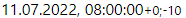
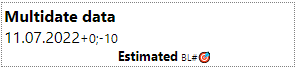
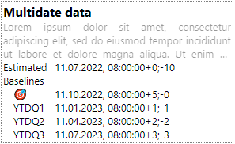

# 'scheduling-multidate' component
React.js component is used to show the date for schedule in product planning (estimated, baselines, fact) with tolerance.

It can display caption, description of date, estimated date value, multiple baselines, factual date
## Display options
Component could be presented in three different exteriors and some optional elements available in all exteriors.

### Exterior: __superbrief__


SUPERBRIEF exterior shows only one date value according with state setting. It can show additional optional values: 
- time, 
- tolerance.

Component shows date and time according with browser regional settings and local time zone

User can change the exterior of component to __brief__

### Exterior: __brief__

### Exterior: __full__

## Definitions
### Estimated date
### Baseline date
### Factual date
### Tolerance

## How to install
```
npm i scheduling-multidate
```
## How to start example
```
cd examples
npm update
npm start
```
U can start your browser to http://localhost:3000 to view all exteriors. Change an exterior of each components by yellow  and green  buttons